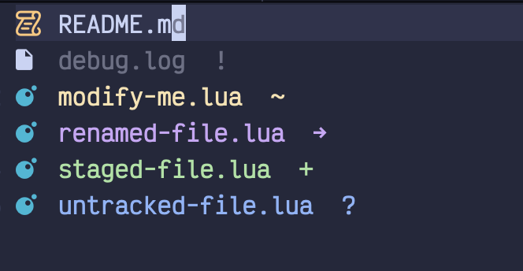

# oil-git.nvim

Git status integration for [oil.nvim](https://github.com/stevearc/oil.nvim) that shows git status by coloring file names and adding status symbols.

## Fork Improvements

This fork includes significant performance fixes and enhancements:

- **Fixed cursor blinking bug** - Eliminated infinite refresh loops caused by GitSigns events that were triggering excessive redraws and cursor flickering
- **Enhanced performance** - Added intelligent debouncing (50ms) and cooldown protection (200ms) to prevent rapid-fire refreshes  
- **Periodic external updates** - Added 3-second periodic refresh to catch git changes from external tools (configurable)
- **Smart refresh logic** - Only refreshes when content actually changes (directory, git status, or buffer content)
- **Improved cleanup** - Better timer management and highlight clearing to prevent memory leaks

### Performance Details

The original plugin suffered from a critical performance issue where GitSigns would fire continuous `GitSignsUpdate` events, creating an infinite loop:
1. GitSigns fires update event
2. oil-git refreshes highlights
3. Refresh somehow triggers GitSigns again
4. Loop continues, causing rapid cursor blinking

**Solution implemented:**
- Removed GitSigns event listener to break the infinite loop
- Added 200ms cooldown between refreshes to prevent rapid-fire updates
- Implemented content change detection to skip unnecessary refreshes
- Added periodic 3-second timer for external git changes

## Screenshot

 

## Features

- **File name highlighting** - Colors files based on git status
- **Directory highlighting** - Colors directories that contain modified files (with italic styling)
- **Status symbols** - Shows git symbols at end of lines
- **Real-time updates** - Automatically refreshes when git changes occur
- **Performance optimized** - No caching, always fresh git status
- **LazyGit integration** - Updates instantly when closing LazyGit or other git tools

## Installation

### With LazyVim/lazy.nvim (No setup required!)

```lua
{
  "Dima-369/oil-git.nvim",
  dependencies = { "stevearc/oil.nvim" },
  -- No opts or config needed! Works automatically
}
```

### Optional configuration

```lua
{
  "Dima-369/oil-git.nvim",
  dependencies = { "stevearc/oil.nvim" },
  opts = {
    highlights = {
      OilGitModified = { fg = "#ff0000" }, -- Custom colors
    },
    periodic_refresh_ms = 3000, -- Customize external update interval
    debug = true,               -- Enable debug logging for troubleshooting
  }
}
```

### With other plugin managers

```lua
-- Packer (no setup required)
use {
  "Dima-369/oil-git.nvim",
  requires = { "stevearc/oil.nvim" },
}

-- Plug (no setup required)
Plug 'stevearc/oil.nvim'
Plug 'Dima-369/oil-git.nvim'
```

## Colorscheme Integration

The plugin respects highlight groups defined in your colorscheme. Add these to your colorscheme or init.lua:

```lua
-- Example: Custom colors in your colorscheme
vim.cmd([[
  highlight OilGitAdded guifg=#00ff00
  highlight OilGitModified guifg=#ffff00  
  highlight OilGitRenamed guifg=#ff00ff
  highlight OilGitUntracked guifg=#00ffff
  highlight OilGitIgnored guifg=#808080
]])
```

The plugin only sets default colors if highlight groups don't already exist.

## Configuration

```lua
require("oil-git").setup({
  highlights = {
    -- File highlights
    OilGitAdded = { fg = "#a6e3a1" },     -- green
    OilGitModified = { fg = "#f9e2af" },  -- yellow  
    OilGitDeleted = { fg = "#f38ba8" },   -- red
    OilGitRenamed = { fg = "#cba6f7" },   -- purple
    OilGitUntracked = { fg = "#89b4fa" }, -- blue
    OilGitIgnored = { fg = "#6c7086" },   -- gray
    
    -- Directory highlights (italic versions for directories containing changes)
    OilGitDirAdded = { fg = "#a6e3a1", italic = true },
    OilGitDirModified = { fg = "#f9e2af", italic = true },
    OilGitDirRenamed = { fg = "#cba6f7", italic = true },
    OilGitDirUntracked = { fg = "#89b4fa", italic = true },
    OilGitDirIgnored = { fg = "#6c7086", italic = true },
  },
  periodic_refresh_ms = 3000,             -- External update interval (default: 3000ms)
  -- disable_periodic_refresh = true,         -- Disable periodic refresh to eliminate cursor blinking
  -- debug = true,                            -- Enable debug logging via vim.notify
})
```

## Git Status Display

| Status | Symbol | Color | Description |
|--------|---------|-------|-------------|
| **+** | Added | Green | Staged new file |
| **~** | Modified | Yellow | Modified file (staged or unstaged) |
| **-** | Deleted | Red | Deleted file |
| **→** | Renamed | Purple | Renamed file |
| **?** | Untracked | Blue | New untracked file |
| **!** | Ignored | Gray | Ignored file |

## Auto-refresh Triggers

The plugin automatically refreshes git status when:

- Entering an oil buffer
- Buffer content changes (file operations in oil)
- Focus returns to Neovim (after using external git tools)
- Window focus changes
- Terminal closes (LazyGit, fugitive, etc.)
- Git plugin events (Fugitive)
- Every 3 seconds (periodic external change detection)

## Commands

- `:lua require("oil-git").refresh()` - Manually refresh git status

## Requirements

- Neovim >= 0.8
- [oil.nvim](https://github.com/stevearc/oil.nvim)
- Git

## License

MIT